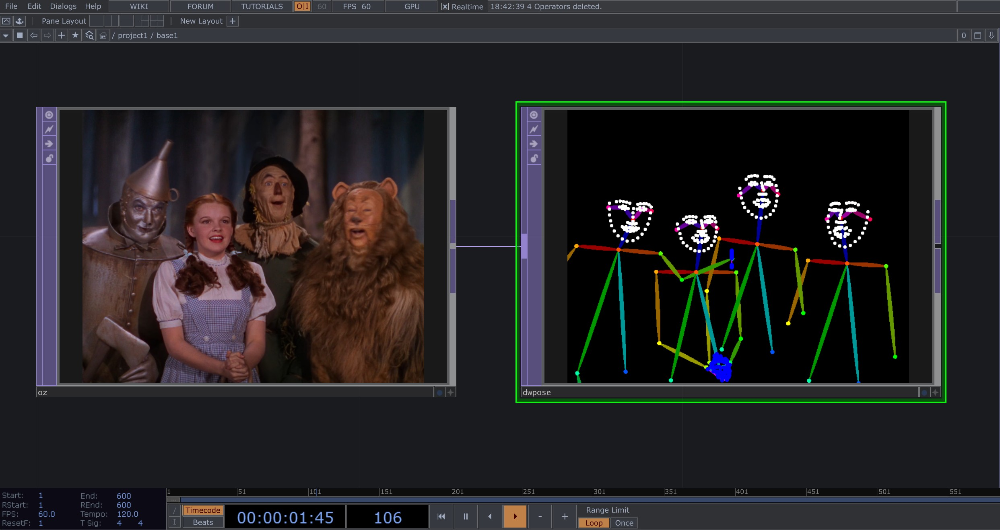
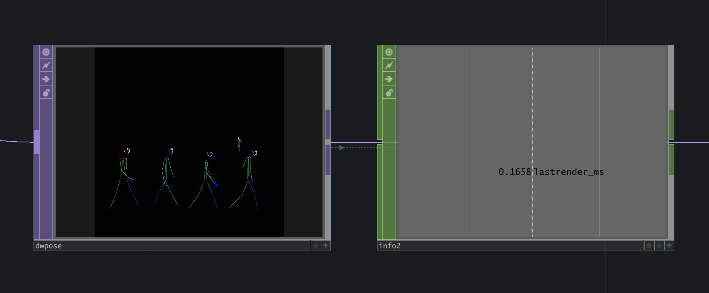

# td-dwpose

A standalone TouchDesigner Custom Operator TOP for **DWPose** whole-body
pose detection. Outputs an OpenPose-format stick-figure suitable for
ControlNet conditioning, runs entirely on the GPU via TensorRT 10.



Body skeleton, both hands (21 keypoints each), and 68 face
landmarks are detected per person, multi-person scenes work out of the
box, and the rendered stick-figure matches `controlnet_aux`'s output
byte-for-byte so any SD ControlNet OpenPose model can consume it
directly.

---

## Contents

- [Requirements](#requirements)
- [Build from source](#build-from-source)
- [Install into TouchDesigner](#install-into-touchdesigner)
- [Usage](#usage)
- [Parameters](#parameters)
- [Info CHOP channels](#info-chop-channels)
- [Architecture](#architecture)
- [Performance](#performance)
- [License](#license)
- [Acknowledgements](#acknowledgements)

---

## Requirements

### System

- **OS**: Windows 10/11 x64 (TouchDesigner Custom Operator plugins
  are Windows-only at present)
- **GPU**: NVIDIA, compute capability 7.5 or newer (Turing / Ampere /
  Ada / Hopper / Blackwell). Tested primarily on RTX 4090. Lower-tier
  Ada / Ampere cards work but expect proportionally lower frame rates.
- **TouchDesigner**: 2023.30000 or newer (any build that supports the
  C++ Custom Operator API).

### Build dependencies

- **Visual Studio 2022** with the *Desktop development with C++*
  workload (provides MSVC 14.36+, the Windows 10/11 SDK, and CMake)
- **CUDA Toolkit 13.x** — install to the default location
  (`C:\Program Files\NVIDIA GPU Computing Toolkit\CUDA\v13.2\`).
  Older CUDA 12.x will require small CMake edits (replace
  `cudart64_13` references with `cudart64_12`).
- **TensorRT 10.x** — download the standalone Windows zip from
  [NVIDIA Developer](https://developer.nvidia.com/tensorrt/download)
  and extract somewhere stable (e.g. `C:\src\TensorRT-10.16.1.11`).
  Set `%TENSORRT_ROOT%` to that path before building.
- **Ninja** (recommended) — bundled with VS 2022's CMake. The build
  scripts use `-G Ninja` by default.

---

## Build from source

From a regular PowerShell or `cmd.exe` window in the repo root:

```cmd
:: 1. Set TensorRT path (adjust to your install location)
set TENSORRT_ROOT=C:\src\TensorRT-10.16.1.11

:: 2. Configure + build the plugin
build.cmd configure
build.cmd build

:: 3. Stage runtime DLLs into ./plugin/ (CUDA + TensorRT)
stage.cmd "C:\Program Files\NVIDIA GPU Computing Toolkit\CUDA\v13.2\bin\x64" "%TENSORRT_ROOT%"
```

After a successful build + stage, `plugin/` contains:

- `td_dwpose_top.dll` — the TouchDesigner plugin entry point
- `dwpose_worker.dll` — the TensorRT/CUDA worker (loaded by the entry
  point with restricted DLL search; see [Architecture](#architecture))
- `nvinfer_*.dll`, `nvonnxparser_10.dll`, `cudart64_13.dll`, … —
  CUDA + TensorRT runtime libraries staged from your install

`build.cmd clean` wipes `build/` and reconfigures from scratch. Use
this when you change CMake options or update CUDA/TRT versions.

### Notes on TensorRT version pinning

The DLLs you stage from `%TENSORRT_ROOT%\bin\` must come from the same
TensorRT distribution that built the engines on disk. Mixing a
pip-installed `tensorrt` wheel with a standalone TRT install is the
single most common cause of `Serialization assertion stdVersionRead ==
kSERIALIZATION_VERSION failed` at engine load — even when both report
the same `10.x.y.z` version string, the actual serialization bytes can
differ. If this happens, delete your `*.engine` files and let the
plugin rebuild them with the runtime that's actually loaded.

---

## Install into TouchDesigner

After building, point TouchDesigner at `plugin/`:

1. Open TouchDesigner. Edit → Preferences → set the **Plugins
   Folder** field to the absolute path of this repo's `plugin/`
   folder, or copy `plugin/*` to your user plugins directory:
   `%USERPROFILE%\Documents\Derivative\Plugins\`.
2. Restart TouchDesigner so the plugin loader picks up the new DLLs.
3. In any network, press `Tab` to open the OP Create dialog. Under
   **Custom → TOP** you should see *DWPose*.

If you don't see it, check the Textport for plugin load errors and
see [Troubleshooting](#troubleshooting).

---

## Usage

1. Drop a *DWPose* TOP into your network.
2. Wire any RGBA TOP into its first input (a `Movie File In TOP`,
   webcam via `Video Device In TOP`, NDI feed, etc.).
3. Set the **Engines Folder** parameter to a writable path, e.g.
   `C:/Users/you/td-dwpose-engines`. (Engine setup instructions are
   pending verification — open an issue if you'd like to use this
   before they land.)
4. Drop an *Info CHOP* and set its `OP` parameter to the DWPose TOP
   to monitor status, performance, and per-frame keypoints. Wait for
   `status == 3 (ready)`.
5. Wire the DWPose TOP's output into your downstream pipeline (an
   OpenPose ControlNet TOP, a screen output, a recorder — any TOP
   consumer). Output is RGBA8 with the OpenPose-style stick-figure
   on a black background.

### Wiring to an SD ControlNet pipeline

The DWPose TOP's output is a drop-in replacement for any
`controlnet_aux.OpenposeDetector(...)`-rendered conditioning image.
The body skeleton uses the canonical 18-point CMU OpenPose color
palette; hand and face landmarks follow the
`controlnet_aux/dwpose/util.py` convention. Any SD ControlNet
checkpoint trained on lllyasviel's annotator (`lllyasviel/control_v11p_sd15_openpose`,
`thibaud/controlnet-sd21-openposev2-diffusers`, and similar) can
consume the output directly.

---

## Parameters

| Parameter | Type | Default | Notes |
|---|---|---|---|
| **Engines Folder** | Folder path | (empty) | Required. Writable directory where the runner stores `yolox.engine`, `dwpose.engine`, and the cached `*.onnx` source models. Set this to a stable per-machine location; engines are GPU + TRT version specific so don't share across machines. |
| **Reload** | Pulse | — | Re-runs engine discovery + load. Pulse this after editing files in the engines folder, swapping models, or after a TRT version change. |
| **Ordered Draw** | Toggle | OFF | When ON, body limbs draw in `controlnet_aux`'s outer-by-limb order so cross-person arm overlaps are depth-consistent. When OFF (default), all limbs dispatch in a single CUDA pass — slightly faster (~1–2 ms savings on 4K with multiple bodies), at the cost of non-deterministic overlap z-order between people. The default favors throughput; flip ON only if you have multi-person scenes where arm-over-arm depth matters visually. |

---

## Info CHOP channels

| Channel | Meaning |
|---|---|
| `status` | Runner state: `0` idle · `1` downloading ONNX · `2` building engine · `3` ready · `4` error |
| `progress` | 0.0–1.0 within the current `status` phase |
| `num_persons` | Detected persons in the current frame |
| `infer_ms` | YOLOX + DWPose inference time, milliseconds |
| `ordered` | Live mirror of the *Ordered Draw* toggle |
| `lastrender_ms` | Stick-figure rasterizer time, milliseconds (includes a `cudaStreamSynchronize` so it's end-to-end render cost) |
| `kp00x` … `kp17x` | OpenPose body keypoint X coords for person 0 (image-pixel space) |
| `kp00y` … `kp17y` | OpenPose body keypoint Y coords for person 0 |

Body keypoint indices follow the OpenPose 18-point convention: `0` nose,
`1` neck, `2-4` right arm, `5-7` left arm, `8-10` right leg, `11-13`
left leg, `14-15` eyes, `16-17` ears. Channels report `0.0` for any
keypoint below the renderer's confidence gate (so what the CHOP
reports matches what the TOP draws).

The stick-figure render also includes hand (21 kp × 2) and face (68
landmarks) keypoints internally, but those are not currently surfaced
on the Info CHOP — only the body 18 are. Open an issue if you need
them exposed.

---

## Architecture

`td-dwpose` is built as **two DLLs**:

```
td_dwpose_top.dll       (thin TouchDesigner plugin shim)
  ↓ loads via LoadLibraryExW with restricted search
dwpose_worker.dll       (owns all TensorRT, CUDA, ONNX-parser linkage)
```

The TOP shim has zero direct imports of `nvinfer_10.dll`,
`nvonnxparser_10.dll`, or any TRT symbol. It calls `LoadLibraryExW`
with `LOAD_LIBRARY_SEARCH_DLL_LOAD_DIR | LOAD_LIBRARY_SEARCH_SYSTEM32`
to load the worker, which restricts Windows' DLL dependency resolver
to the `plugin/` folder + System32 — explicitly excluding
TouchDesigner's `bin/` folder.

This is necessary because TouchDesigner ships its own
`nvinfer_10.dll`, and Windows' default DLL search would pick TD's
copy over the plugin's, which is often a different TensorRT version. The
restricted load forces our staged TRT runtime to win the search
deterministically.

A C ABI (`runner/dwpose_worker_c.h`) is the boundary between the
two DLLs. The TOP-side `DWPoseRunner` class is a thin facade over
this ABI, which is delay-loaded (`/DELAYLOAD:dwpose_worker.dll`) so
no TRT symbols resolve until after the manual `LoadLibraryExW` has
pinned the worker.

The worker contains:
- TensorRT runtime + ONNX parser
- CUDA pre-processing (resize + normalize for YOLOX / DWPose)
- CUDA stick-figure rasterizer (oriented ellipse polygons for
  body limbs, Bresenham-equivalent lines for hand finger chains,
  filled circles for keypoint dots)
- HuggingFace download (libcurl) and engine build orchestration

---

## Performance

Measured on RTX 4090 Laptop, Windows 11, single input with 4+ people, inference time is sub-millisecond. Mileage may vary.



---

## License

MIT — see `LICENSE`.

The vendored TouchDesigner Custom Operator SDK headers under
`third_party/derivative/` remain Derivative Inc.'s property and are
distributed under their Shared Use License.

---

## Acknowledgements

- [DWPose](https://github.com/IDEA-Research/DWPose) by IDEA-Research —
  the underlying whole-body pose model
- [`yzd-v/DWPose`](https://huggingface.co/yzd-v/DWPose) — the ONNX
  model release used by this plugin
- [`controlnet_aux`](https://github.com/huggingface/controlnet_aux)
  by HuggingFace — the reference Python renderer this plugin's
  CUDA rasterizer matches byte-for-byte
- [CMU OpenPose](https://github.com/CMU-Perceptual-Computing-Lab/openpose)
  — the original 18-point body keypoint convention + color palette
- [Derivative Inc.](https://derivative.ca/) — TouchDesigner and the
  Custom Operator C++ API
